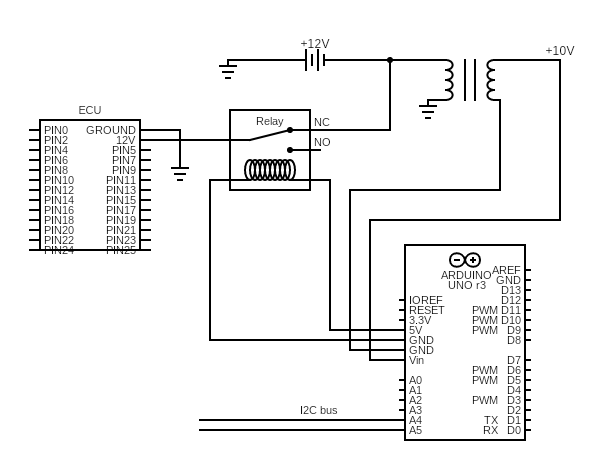

# Mega Immobiliser
## A Microcontroller based immobiliser for older cars that works with the presence of a smart phone.

This is a rough diagram of the design of the immobiliser, it uses a relay to control power to the ECU.
I2C line features (all optional):
- Bluetooth for enabling the immobiliser and smartphone control(switch used otherwise).
- Screen for status of immobilier (might present secuirty flaw).
- GPS to detect movement if ECU Relay is bypassed.
- Camera with facial recognition to help identify theif.
- Motion sensor to detect tow away theft or to check if relay has been bypassed.
- Sound sensor to check if engine running unexpectedly.
- Buzzer or hook into car horn for alarm.
- 4G dongle to allow photo upload.
## This there are a few potential flaws with the system that will be addressed:
- The Relay can be bypassed and the vehicle will still start, therefore GPS tracking and facial recognistion will help by tracking the stolen car, and recording the theif.
- If the car is given to someone else i.e a garage or a valet the smart phone may not be available, therefore the system will have a valet mode to allow normal use.
- The most secure system is one the theif doesn't know is present, so the status screen might be too obvious, instead a small LED can be hidden to indicate locking or errors.
- To prevent battery drain the arduino will be powered off the ignition line, i.e only powered when the key is inserted. Howevever, the arduino takes around 10 seconds to power and this delay may be annoying so using a sleep mode on a 12v source directly from the battery, with the ignition line as the wake up, maybe preferable. This would also allow for systems like break-in detection, and tow away theft detection.
